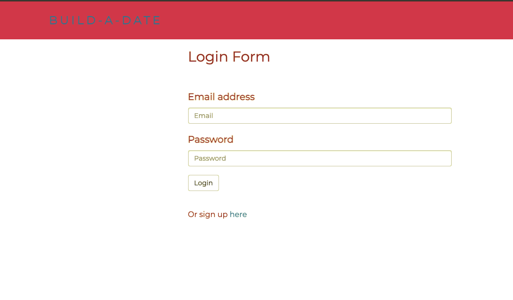
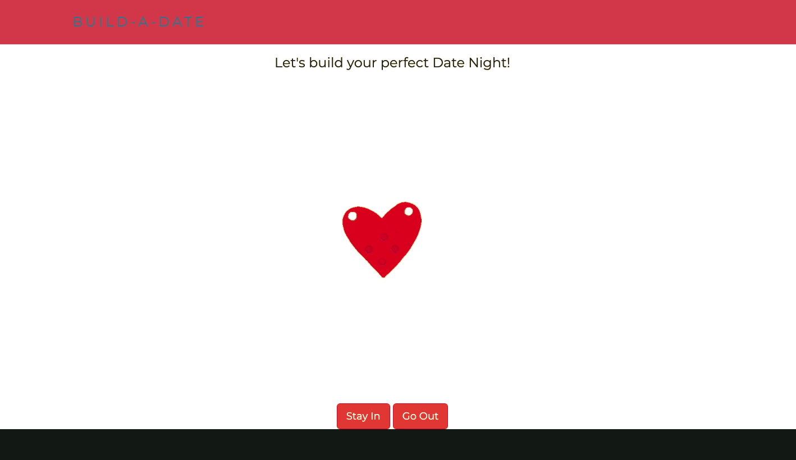
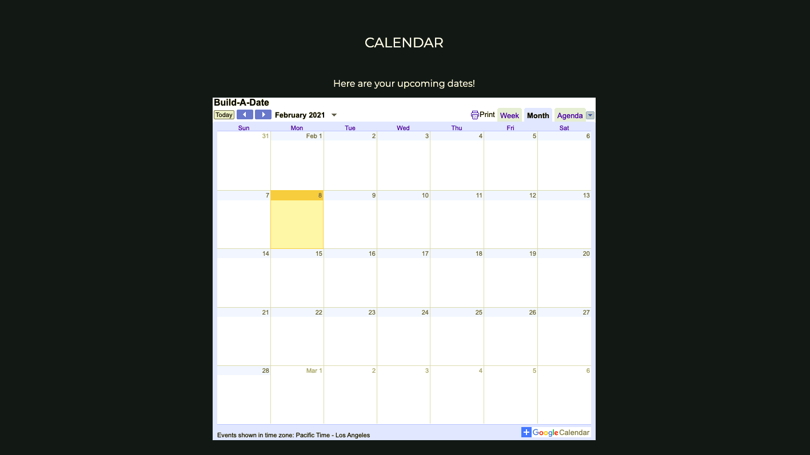
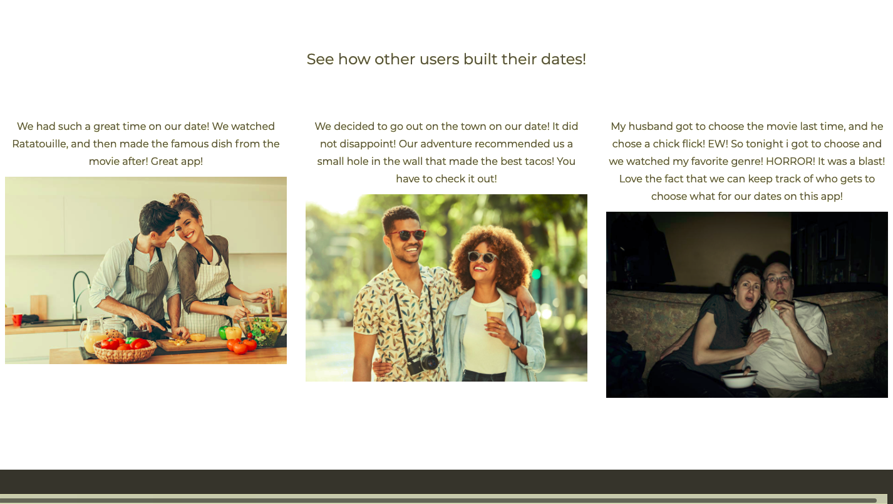
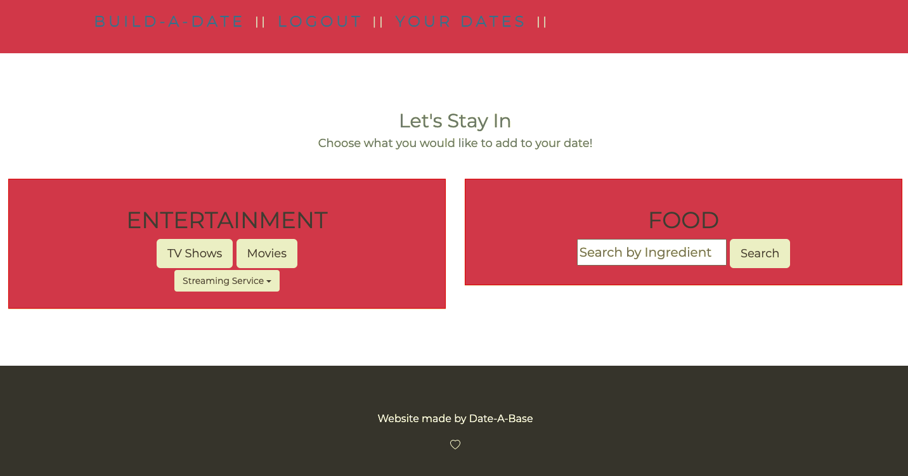
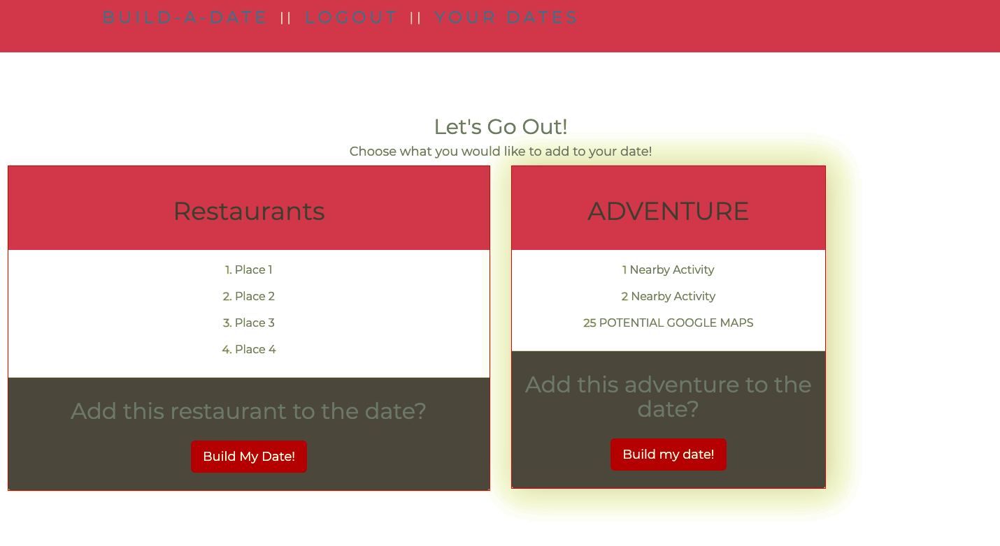
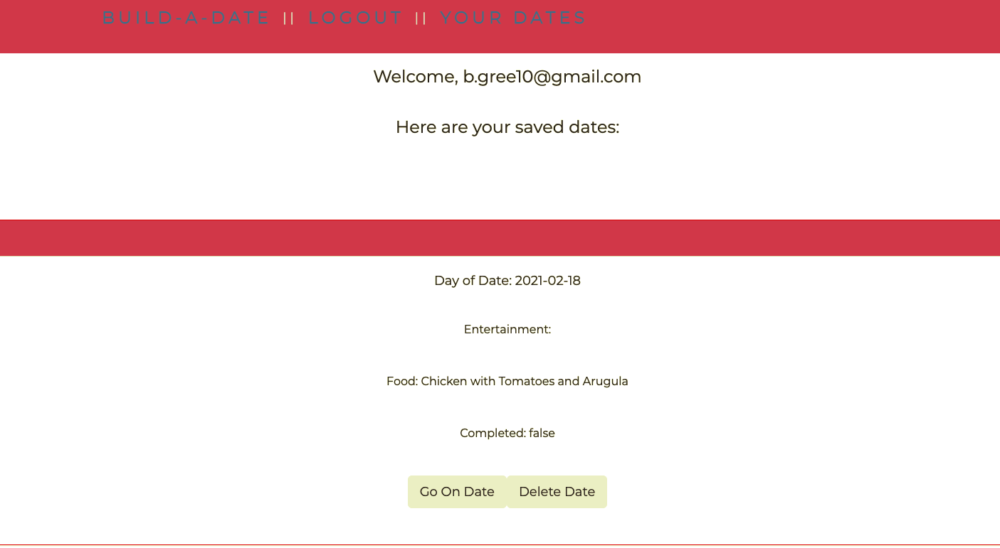

# Build-A-Date 
This project was centered around application that allows you to build a date that is specific to your taste and preferences, and saves that data so that you can have access to it whenever you want!

## Description

This is an app that uses Handlebars, Express, HTML, CSS, & MySQL database system. 

## Table of Contents 

* [Installation](#installation)

* [Usage](#usage)

* [Contributing](#contributing)

* [Tests](#tests)

* [Questions](#questions)

## Installation

To install necessary dependencies, run the following command:

* npm i
* node server.js

## Usage

* Sign up for an account on the sign in page or visit the login page to log in. 
* Choose whether or not you would like to stay in for your date, or go out. 
* IF you choose to go out, you will be able to search restaurants, or different business nearby, using the Yelp Api. 
* IF you choose to stay in, you will be able to search movies and TV shows based on the subscriptions you pay for. You will also be able to search recipes you can make at home. 
* All these dates that you build will be saved to your date-a-base!

  
## Contributing

other users may not contribute to this repo

## Tests

To run tests, run the following command:

npm test

## Screenshots of App

## Link to the application
...

## Questions

If you have any questions about the repo, open an issue or contact us. Thank you!

